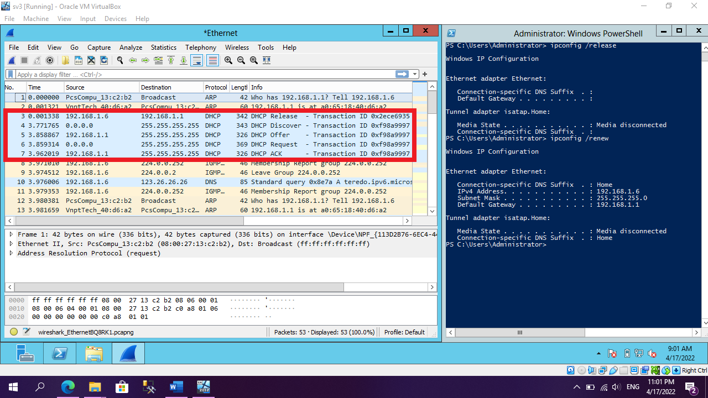
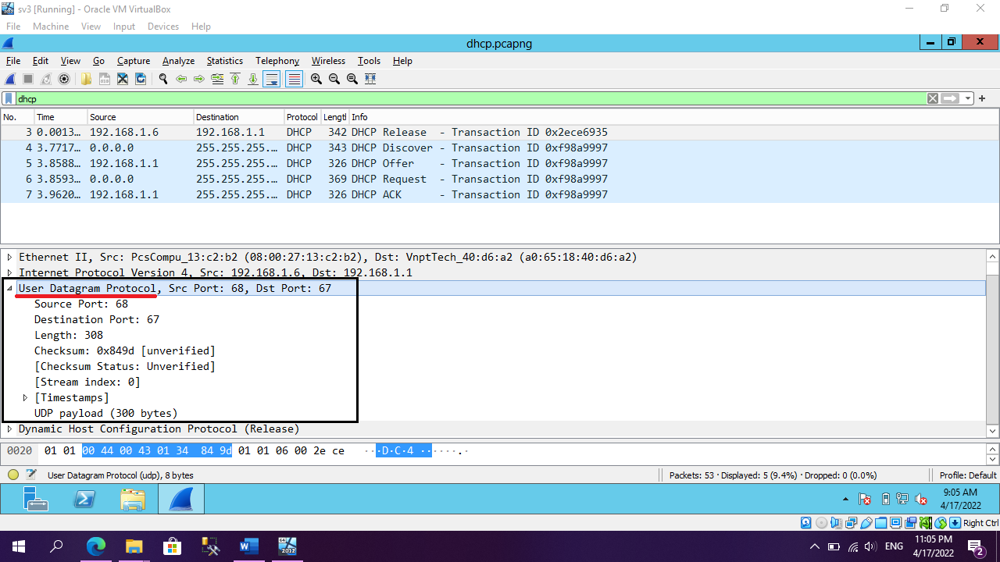

# Bài 4: DHCP

1. Chụp hình kết quả sau khi bắt được gói tin (thấy những gói tin DHCP trong quá trình release, renew)

2. DHCP message dùng UDP hay TCP tại tầng transport? Tại sao?

- DHCP sử dụng UDP tại tầng transport
- Nguyên nhân: Trong quá trình `release`, client cần giải phóng IP hiện tại, dẫn đến việc không có địa chỉ IP nguồn để có thể thực hiện kết nối TCP. Trong quá trình `renew`, client chưa có địa chỉ (`0.0.0.0`) và không biết địa chỉ của DHCP server nên phải thực hiện gửi tin tới địa chỉ broadcast (`255.255.255.255`), chỉ có thể thực hiện thông qua giao thức phi kết nối như là UDP.

3. Mục đích của DHCP release message là gì? DHCP client có đảm bảo lúc nào cũng nhận được ACK message từ Server? Chuyện gì xảy ra nếu DHCP release message của Client bị mất?
- Mục đích: thông báo việc giải phóng địa chỉ IP (của máy gửi) đến DHCP server
- DHCP server không gửi message ACK đối với DHCP Release message.
- Nếu như DHCP message của Client bị mất, DHCP server phải chờ cho hết thời gian cấp của IP đó, mới có thể cấp lại cho client khác.
4. Một người cấu hình DHCP server cho modem của một quán cafe với thời gian cấp là 8 tiếng, và cấp IP thuộc đường mạng **192.168.1.0/24** với **range IP từ 192.168.1.10 đến 192.168.1.100**. Giả sử bắt đầu ngày mới và modem này được mở lên vào lúc 7:00 AM. Người uống cafe đến uống, ai cũng truy cập vào mạng wifi để truy cập Internet. Lượng khách cứ đi vào ra liên tục từ 7:00 AM đến 11:00 AM. Khi đến 11:00 AM, thì quán đón vị khách thứ 92 (và trong quán chỉ còn 20 khách đang uống và truy cập Internet) và người này không thể nào truy cập được Internet mặc dù đã nhập đúng pass Wifi. Hỏi:

    a. Chuyện gì đã xảy ra mà vị khách thứ 92 không thể truy cập được Internet:
    - Có **91** địa chỉ từ 192.168.1.10 đến 192.168.1.100
    - Thời gian cấp cho DHCP server là **8 tiếng**.
    - Thời điểm mở quán và modem vào lúc 7:00AM. Giả sử vị khách đầu tiên đến đúng lúc đó và rời đi, thì phải đến **3:00PM** (sau 8 tiếng) thì địa chỉ đó mới được DHCP server thu hồi lại để cấp cho client mới
    - Vậy nên khi vị khách 92 đến nhưng không truy cập được là do DHCP server đã cấp hết địa chỉ (91 IP), và chưa đến thời điểm thu hồi nên không có IP cho vị khách này.

    b. Vậy những vị khách tiếp theo 93, 94, ....có truy cập được hay không? và có thể truy cập vào thời điểm nào?
    
    Những vị khách tiếp theo cũng không thể truy cập được vào thời điểm đó. Họ chỉ có thể truy cập sau 3:00PM và trong quán phải có ít hơn 91 người.

    c. Chủ quán cafe nên làm gì để vị khách thứ 92 có thể truy cập được Internet và hướng giải quyết để khắc phục tình trạng này về sau là gì?
    - Cách khắc phục đơn giản là khởi động lại modem. Khi ấy, dữ liệu về các IP được cấp sẽ được xóa và các máy tính trong mạng sẽ gửi request lên DHCP server để lấy lại IP. Tuy nhiên, cách này sẽ gây trải nghiệm không tốt với người dùng (mạng đột nhiên bị ngắt), và không phải lúc nào cũng biết được IP đã được cấp hết chưa.
    - Hướng giải quyết về sau: Do đây là quán cafe, hầu hết mọi người chỉ ở lại quán khoảng 1 tiếng, số người truy cập cùng lúc không quá nhiều (đến 11:00AM chỉ có 20 khách ở quán) nên ta có thể giảm thời gian cấp xuống (1 - 2 tiếng). Đối với quán có quy mô lớn, lượng người truy cập cùng lúc nhiều (lớn hơn 91) thì cần phải mở rộng range IP của DHCP server.